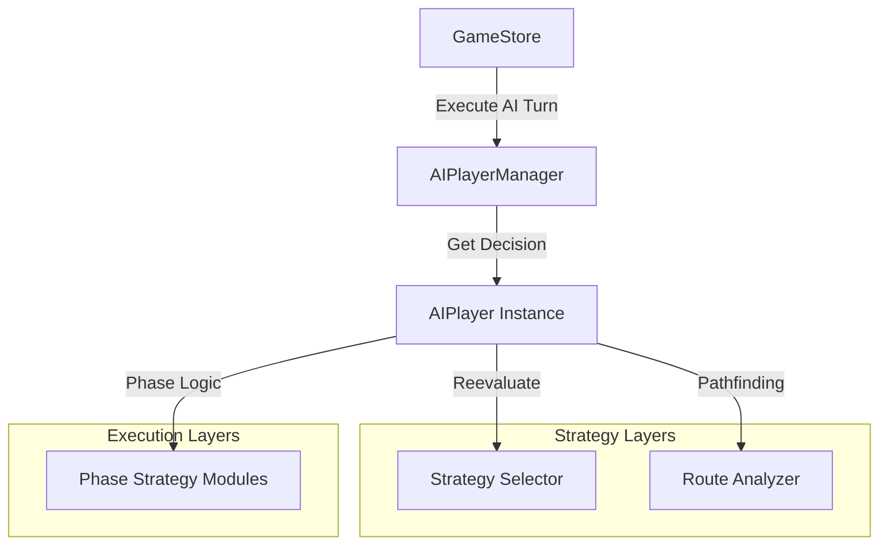

# Age of Steam Showcase - AI 전략 알고리즘 심층 가이드

본 문서는 프로젝트에 구현된 AI 엔진의 내부 로직, 수학적 모델 및 의사결정 프로세스를 전문적으로 상세히 설명합니다.

---

## 1. AI 아키텍처 개요 (Architecture Overview)

AI 시스템은 **객체 지향 모델(OOP)**을 기반으로 설계되었으며, 상태 관리와 의사결정 로직이 분리된 레이어 구조를 가집니다.

### 1.1 핵심 모듈 구성
- **AIPlayerManager**: 모든 AI 플레이어의 생명주기를 관리하는 싱글톤.
- **AIPlayer**: 플레이어별 독립된 전략 상태, 경로 캐시, 의사결정 엔진 보유.
- **Analyzer**: A* 경로 탐색 및 보드 그리드 기하학 분석.
- **Selector**: 화물 배치 기반 동적 가치 산정 및 전략 수립.
- **Evaluator**: 게임 상태 수치화 및 비용 추정.

---

## 2. 경로 탐색 알고리즘 (A* Pathfinding)

AI는 지형 비용과 상대방의 방해 요소를 고려하여 최적의 경로를 계산합니다.

### 2.1 지형 비용 모델 (Terrain Cost Table)

| 지형 (Terrain) | 기본 건설 비용 ($) | AI 탐색 가중치 | 비고 |
| :--- | :---: | :---: | :--- |
| **평지 (Plain)** | 2 | 2 | 기본 비용 |
| **강 (River)** | 3 | 3 | 추가 교량 비용 |
| **산 (Mountain)** | 4 | 4 | 터널/경사지 비용 |
| **호수 (Lake)** | ∞ | ∞ | 건설 불가 |
| **자사 트랙** | - | 0.1 | 기존 경로 유지 강력 유도 |
| **타사 트랙** | - | 5 / ∞ | 단순 트랙은 교차 가능(5), 복합은 차단(∞) |

### 2.2 휴리스틱 (Heuristic)
- **Axial Hex Distance**: 헥사곤 그리드의 Axial 좌표계를 사용하여 정확한 최단 거리를 측정합니다.
  - `dist = max(|dx|, |dy|, |dz|)`

---

## 3. 동적 화물 우선순위 산정 (Cargo Selection)

AI는 `Opportunities` 분석을 통해 현재 보드에서 가장 가치 있는 배달 목표를 선택합니다.

### 3.1 목표 거리 최적화 (Target Distance Scoring)

AI는 엔진 레벨($L$)을 기준으로 현재보다 한 단계 높은 미래 가치를 선점하도록 설계되었습니다.

$$Score_{Dist} = max(0, 600 - |Distance - (L + 1)| \times 150)$$

| 거리 ($D$) | 점수 (Bonus) | 전략적 의도 |
| :--- | :---: | :--- |
| **$L + 1$** | **+600** | **최우선 순위**: 다음 턴 엔진 업그레이드 시 즉시 배달 가능 |
| **$L$** | +450 | **차선 순위**: 현재 엔진 레벨에서 즉시 배달 가능한 최대 거리 |
| **$L + 2$** | +450 | 장기적 포석: 두 번의 엔진 업그레이드 필요 |
| **$L - 1$** | +300 | 안정적 수익: 짧은 거리 배달 |
| 기타 | 점진적 감소 | 거리에 따른 기회비용 반영 |

---

### 3.2 최소 배달 보장 (Reliability First)

AI는 이번 턴에 **최소 1개 이상의 화물 배달**이 가능하도록 전략적 우선순위를 동적으로 조정합니다.

- **배달 부재 상황**: 현재 완성된 경로가 0개라면, 이번 턴 내 완공 가능한(잔여 거리 $\le 3.2$) 경로에 **+2500점**의 압도적 가중치를 부여합니다.
- **장거리 링크 선호**: 배달 가능한 후보들 중에서는 수익 극대화를 위해 엔진 레벨에 도달하는 가장 긴 링크를 우선적으로 선택합니다. ($Score_{Long} = Distance \times 25$)

---

## 4. 트랙 건설 로직 (Track Build Strategy)

건설 단계에서는 각 헥스와 엣지의 방향성을 정밀 평가합니다.

### 4.1 트랙 평가 가중치 (`evaluateTrackForRoute`)

| 평가 항목 | 가중치 | 설명 |
| :--- | :---: | :--- |
| **Optimal Path** | +100 | A* 최적 경로상에 위치 |
| **Next Position** | +50 | 현재 망 끝에서 바로 이어지는 위치 |
| **Correct Edge** | +80 | 엣지 방향이 목표 도시를 향함 |
| **Wrong Direction**| -50 | 경로와 무관한 방향의 엣지 |
| **Trap/Loop** | -500 | 막다른 길 또는 무의미한 루프 형성 |

### 4.2 네트워크 확장 모드 (Expansion Mode)
배달 가능한 화물이 없을 경우, AI는 **네트워크 확장(Network Expansion)** 모드로 전환됩니다.
- 아직 연결되지 않은 가장 가까운 도시를 타겟으로 자동 설정합니다.
- `priority: 2`를 부여하여 화물 배달 대비 낮은 우선순위로 관리합니다.

---

## 5. 경제 및 재무 관리 (Financial Management)

### 5.1 주식 발행 (Issue Shares)
- **예측 모델**: `(예상 트랙 비용: $9) + (이자/유지비: 주식수 + 엔진레벨)`
- **발생 판단**: 현금이 `Shortage` 발생 시에만 주당 $5 단위로 발행.
- **보수성**: 주식은 영구적인 감점(-3점)이므로, 한 턴에 최대 **2주**를 초과하여 발행하지 않도록 제한합니다.

### 5.3 맵별 엔진 레벨 제한 (Map Constraints)

각 맵의 규모와 밸런스를 고려하여 엔진 업그레이드 상한을 설정합니다.

- **Tutorial 맵**: **최대 레벨 3**으로 제한. 맵이 좁아 과도한 엔진 업그레이드보다는 효율적인 단거리 배달 및 주식 관리가 중요합니다.
- **기타 맵**: 일반적인 룰북 규정에 따라 **최대 레벨 6**까지 허용합니다.

---

---

## 6. AI 디버그 시스템 (Debug Interface)

실시간 분석을 위해 브라우저 콘솔 인터페이스를 제공합니다.

| 명령어 | 용도 | 출력 데이터 |
| :--- | :--- | :--- |
| `debugAI(state, pid)` | 종합 분석 | 전략, 페이즈 결정, 경로 정보 전체 |
| `getAIReport()` | 매크로 리포트 | 모든 플레이어의 전략적 상태 요약 |
| `debugStrategy(pid)` | 전략 심층 분석 | DeliveryOpportunity 점수 리스트 |
| `debugPaths(pid)` | 경로 가시화 | A* 탐색 결과 헥스 좌표 배열 |
